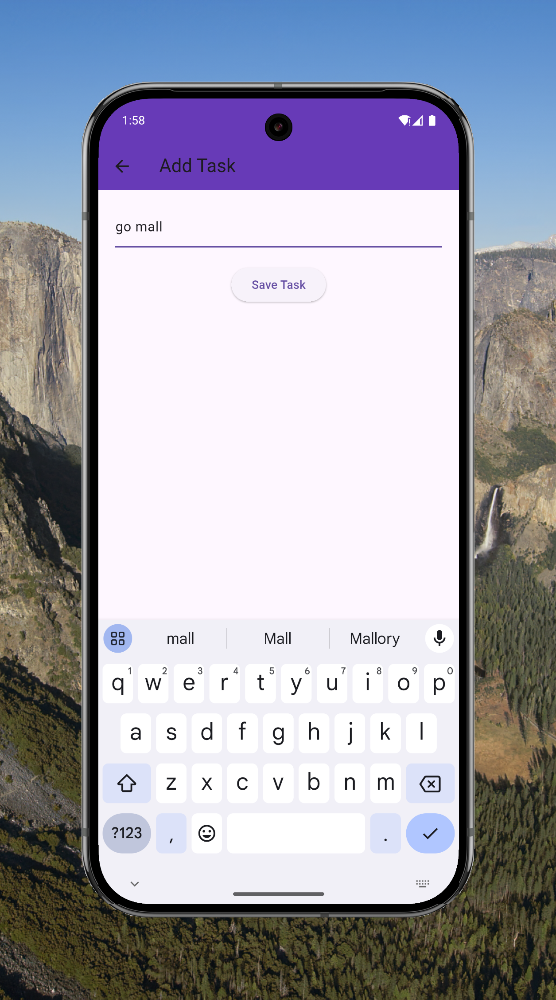
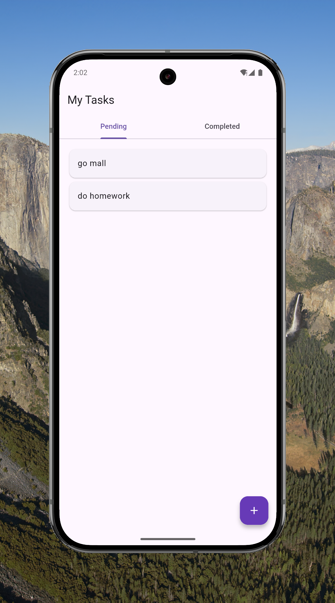
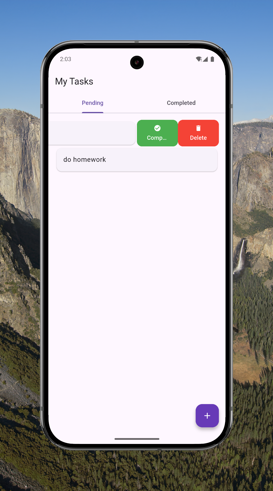
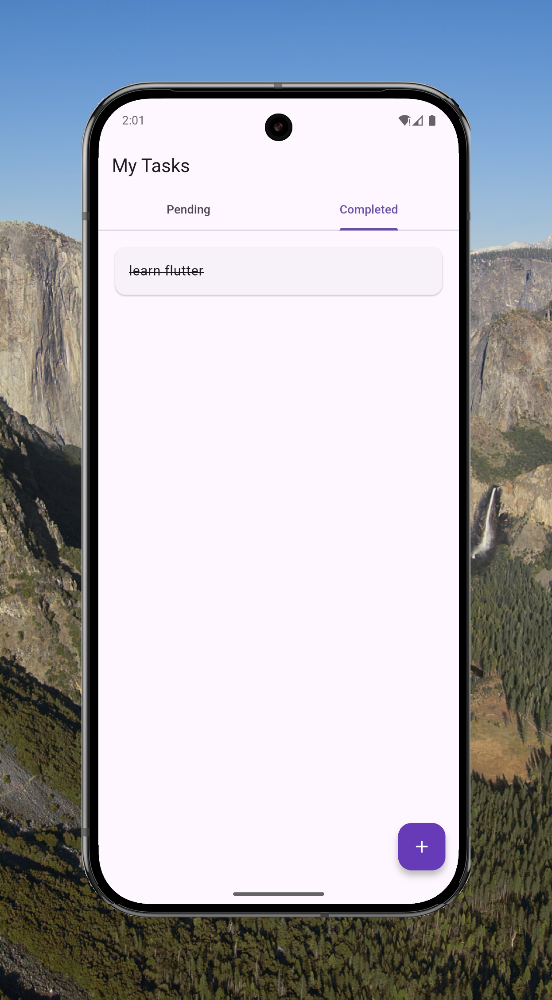
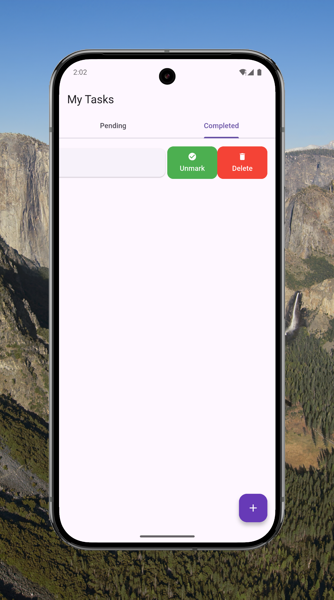

# ToDo App ✅

A clean and simple Flutter ToDo app with task creation, completion tracking, and tab-based filtering.  
Built to demonstrate Flutter state management, persistent storage, and clean architecture.

## ✨ Features
- Add new tasks
- Mark tasks as completed
- View pending & completed tasks in separate tabs
- Delete tasks with swipe action
- Data persistence using SharedPreferences

## 🛠 Tech Stack
- **Flutter** (Material Design)
- **Dart**
- **SharedPreferences** (local storage)
- **flutter_slidable** (swipe to delete)

## 📸 Screenshots
| Add Task | Pending Task List | Pending Task List (Options) |
|----------|-------------------|-----------------------------|
|  |  |  |

| Completed Task List | Completed Task List (Options) |
|---------------------|-------------------------------|
|  |  |

## 🚀 Getting Started

1. **Clone the repo**
```bash
git clone https://github.com/SwitU7Ronald/todo_app.git
cd todo_app
